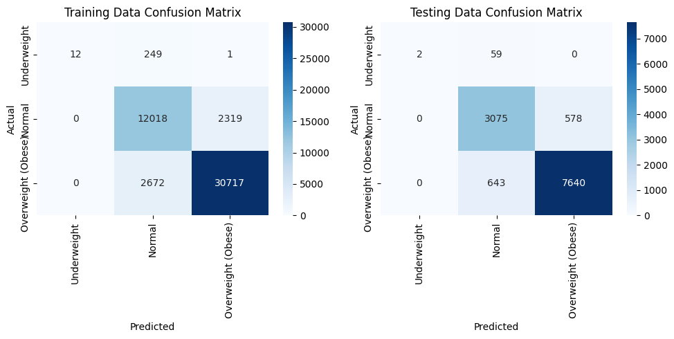
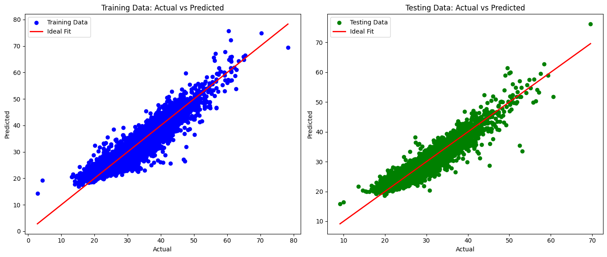
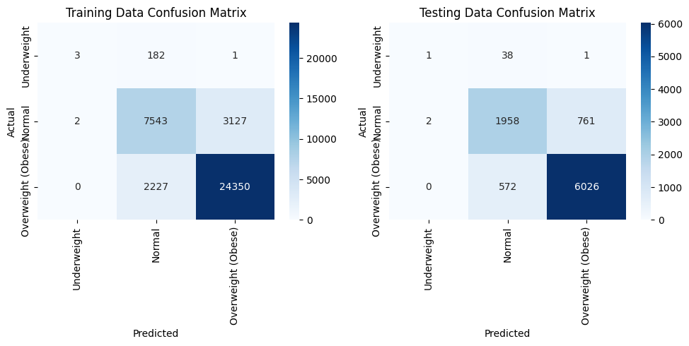
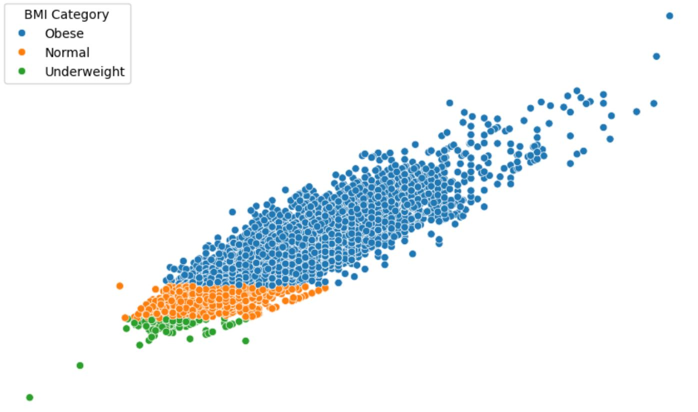
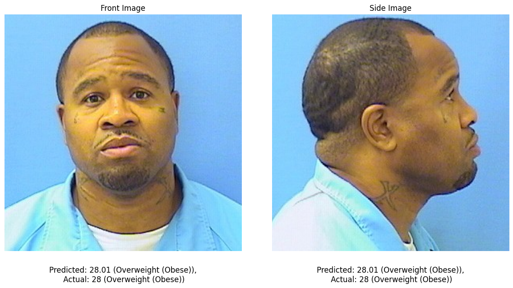

# Gender Classification and BMI Prediction from Facial Features

This project aims to **predict gender** and **estimate Body Mass Index (BMI)** from facial images using deep learning and machine learning techniques. We use both **front** and **side profile images** to extract meaningful features and train models for classification and regression tasks.

---

## 📁 Dataset

The dataset consists of paired **front-view** and **side-view** facial images, along with metadata including gender, height, weight, and derived BMI values.

### Columns Description:

| Column Name      | Description                                                               |
|------------------|---------------------------------------------------------------------------|
| `Image_Name`     | Unique image identifier (used to load corresponding front and side views)|
| `Gender`         | Gender label (`0` = Male, `1` = Female)                                   |
| `Height`         | Height in meters                                                          |
| `Weight`         | Weight in kilograms                                                       |
| `BMI`            | Body Mass Index = Weight (kg) / (Height (m))²                            |
| `BMI_Category`   | Category derived from BMI: Underweight, Normal, Overweight (Obese)        |
| `Face_Embedding` | Extracted features from CNN (e.g., FaceNet or VGG16)                      |

---

## ⚙️ Data Preprocessing

- Removed outliers: BMI < 10 or > 50
- Filtered corrupted or inconsistent images
- Images resized to `128x128` and converted to grayscale
- Computed BMI and categorized it
- Encoded gender as 0/1

---

## 🔍 Feature Extraction

### ✅ VGG16
- Pre-trained CNN model used to extract high-dimensional features from both **front** and **side** images.
- Combined features resulted in around **30,000 dimensions**.

### ✅ FaceNet
- Used to extract more compact **face embeddings** (1000 from each image).
- Final feature vector = concatenated features from front and side images.

---

## 🧠 Model Training

### 🎯 Tasks:
- **BMI Prediction**: Linear Regression
- **Gender Classification**: Logistic Regression

### 📊 Data Split:
| Task               | Train Samples | Test Samples |
|--------------------|---------------|--------------|
| Gender Classification | 48,888        | 12,222       |
| BMI Prediction        | 47,988        | 11,997       |

---

## 📈 Results

### 🔹 Gender Classification

- Confusion matrices show strong performance on both training and testing sets.

### 🔹 BMI Regression Performance

| Metric              | Training | Testing |
|---------------------|----------|---------|
| Mean Absolute Error | 1.24     | 1.25    |
| Mean Squared Error  | 2.77     | 2.79    |
| R² Score            | 0.89     | 0.89    |
| Pearson Correlation | 0.947    | 0.946   |

### 🔹 BMI Classification Performance

### 🔹 Overall Distribution

---

## 🎯 Sample Prediction Example

---

## 📌 Tools & Technologies

- Python
- OpenCV
- TensorFlow / Keras
- Scikit-learn
- NumPy, Pandas
- Matplotlib, Seaborn

---

## 👨‍💻 Contributors

- Ajmal – CS22B2046  
- Ashiq Irfan – CS22B2021  
- Abhishek Chakravarthy – CS22B2054  

---

## 📅 Submission Date

December 5, 2024
